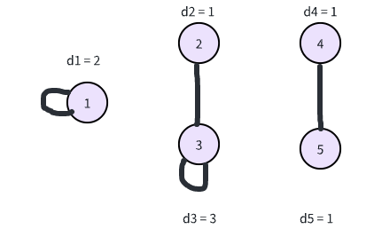

# 孤岛之歌

## 题目描述

给定一个度数序列 $d_1, d_2, \dots, d_n$，请你构造一个满足此度数序列，且连通分量数最大的无向图，输出最大的连通分量数。如果无法构造这样的无向图，输出 $-1$。

注意，构造的无向图不一定是简单图，即可以存在自环和重边。

名词解释
- 自环：一条边的连接的两个端点是同一个节点，称这条边为一个自环。
- 重边：两个节点之间存在多条边，称两节点间存在重边。
- 节点度数：图中一个节点的度数是该节点作为一条边的端点所出现的次数，特别的，一个自环 $(u,u)$，节点 $u$ 在作为这条边的端点两次，度数也要计两次。
- 度数序列：度数序列 $d_1, d_2, \dots, d_n$，表示 $\forall i \in [1,n] \cap Z$，节点 $i$ 的度数为 $d_i$。
- 连通分量：一个连通分量是指一个“最大”的子图，其中任意两个顶点都是连通的，即在这个子图中的任意两个顶点间都存在路径连接它们。此外，这个子图是“最大”的，含义是不存在更大的子图包含这个子图的同时还满足连通性。

## 输入
第一行输入一个正整数 $n$（$1 \le n \le 100$），表示图的节点个数。

第二行 $n$ 个非负整数 $d_1, d_2, \dots, d_n$（$0 \le d_i \le 100$），表示度数序列。

## 输出
如果能构造出满足此度数序列的无向图，输出最大连通分量数；否则，输出 $-1$。


## 样例输入1
```
5
2 1 3 1 1
```

## 样例输出1
```
3
```

## 样例1解释
可以构造如下的图，并且不存在连通分量数大于 $3$ 且度数序列满足题目的图。


## 样例输入2
```
5
1 3 1 4 2
```

## 样例输出2
```
-1
```

## 样例2解释
不存在图的度数序列满足情况。