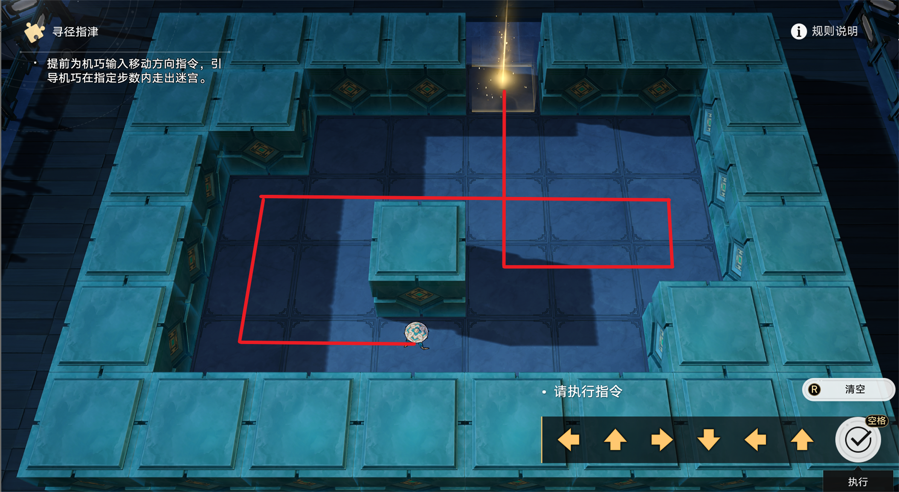

凉刃老师在和棋鬼下一种特殊的棋，棋盘可以看成 $n$ 行 $m$ 列个格子组成的网格，每个格子要么为墙壁要么为空地，最外一圈必定为墙壁，棋子只能停在空地中。

每次开始一局棋时，你有一个棋子在某个起点格子上，需要将棋子移动到某个终点格子。每次移动需要先选择上下左右中一个方向，随后将棋子沿该方向一直移动直到遇到墙壁，并在移动到墙壁的前一个空地上停下。

现在凉刃老师和棋鬼在紧张地对弈中，他想让你帮他求出最少需要多少步才能将棋子从起点移动到终点并**最终停在终点(经过终点不算)**。

## 输入

第一行两个整数 $n, m$（$4 \leq n, m \leq 1000$） 表示棋盘的行列

接下来 $n$ 行每行一个长度为 $m$ 的字符串表示棋盘第 $i$ 行

其中 '.' 表示空地，'#' 表示墙壁，'S' 表示起点，'T' 表示终点

保证最外围一圈是墙壁，只有一个 'S' 和 'T'

## 输出

一行一个整数，表示至少需要的步数，如果无法到达输出 $-1$

## 样例输入

```txt
7 7
#######
#S...##
##.#.##
##....#
#...#.#
#....T#
#######
```

## 样例输出

```txt
4
```

