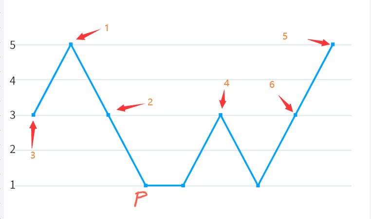
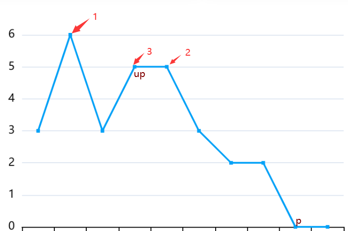

- [A 寻径指津](#a-寻径指津)
- [B 猜数字](#b-猜数字)
- [C 滚动数组1](#c-滚动数组1)
- [D 滚动数组2](#d-滚动数组2)
- [E 背单词](#e-背单词)
- [F 孤岛之歌](#f-孤岛之歌)
- [G 区间递减](#g-区间递减)
  - [相关习题](#相关习题)
  - [解法](#解法)
    - [由图得解](#由图得解)
    - [详细证明](#详细证明)
    - [实现](#实现)
- [H 憧憬成为数字高手](#h-憧憬成为数字高手)
- [I 选购计划](#i-选购计划)
- [J 想吃KFC](#j-想吃kfc)

# A 寻径指津

因为移动的代价都是1，所以是标准的bfs问题，但是与bfs不同的是四个方向的移动不是相邻的，而是一直移动到边界。

所以，我们只需要找到四个方向移动到达的位置，就可以用基本的bfs解决问题。

寻找往右走达到的点可以这么处理——对于第$x$行的点，我们可以通过从第$m$列往第$1$列开始遍历，初始设置变量$now=m$，如果碰到在$j$位置为'#'，那么标记$now=j-1$，如果碰到的不是'#'，那么位置$(x,j)$往右走可以到达的位置就是$(x,now)$，前者连单向边指向后者。

一行找连点的复杂度是$o(m)$，每行找完的复杂度就是$o(n*m)$，同样的原理对其它三个方向进行预处理连边。

连边完成以后进行bfs

参考代码

```cpp
#include<bits/stdc++.h>

using namespace std;

const int inf=(1<<30);

vector<pair<int,int>> g[1010][1010];
int n,m,d[1010][1010];
char ch[1010][1010];

void bfs(int x,int y)
{
	deque<pair<int,int>> now;
	now.push_back({x,y});
	d[x][y]=0;
	while(!now.empty())
	{
		x=now.front().first,y=now.front().second;
		now.pop_front();
		for(auto k:g[x][y])
		{
			int X=k.first,Y=k.second;
			if(d[X][Y]>d[x][y]+1)
			{
				d[X][Y]=d[x][y]+1;
				now.push_back({X,Y});
			}
		}
	}
}

int main()
{
	ios::sync_with_stdio(false);cin.tie(0);cout.tie(0);
	cin>>n>>m;
	for(int i=1;i<=n;i++)
	{
		for(int j=1;j<=m;j++)
		{
			cin>>ch[i][j];
			d[i][j]=inf;
		}
	}
	for(int i=1;i<=n;i++)
	{
		long long now=1;
		for(int j=1;j<=m;j++)
		{
			if(ch[i][j]=='#')
			{
				now=j+1;
			}
			else
			{
				g[i][j].push_back({i,now});
			}
		}
	}
	for(int i=1;i<=n;i++)
	{
		long long now=m;
		for(int j=m;j>=1;j--)
		{
			if(ch[i][j]=='#')
			{
				now=j-1;
			}
			else
			{
				g[i][j].push_back({i,now});
			}
		}
	}
	for(int i=1;i<=m;i++)
	{
		long long now=1;
		for(int j=1;j<=n;j++)
		{
			if(ch[j][i]=='#')
			{
				now=j+1;
			}
			else
			{
				g[j][i].push_back({now,i});
			}
		}
	}
	for(int i=1;i<=m;i++)
	{
		long long now=1;
		for(int j=n;j>=1;j--)
		{
			if(ch[j][i]=='#')
			{
				now=j-1;
			}
			else
			{
				g[j][i].push_back({now,i});
			}
		}
	}
	int x,y;
	for(int i=1;i<=n;i++)
	{
		for(int j=1;j<=m;j++)
		{
			if(ch[i][j]=='S')
			{
				bfs(i,j);
			}
			else if(ch[i][j]=='T')
			{
				x=i;y=j;
			}
		}
	}
	if(d[x][y]==inf)d[x][y]=-1;
	cout<<d[x][y];
	return 0;
}
```


# B 猜数字

签到题

虽然有预想会有少部分同学不知道这个梗，但是实际上比较多（

于是在开赛后不久再加了一条提示

输出 $50$ 即可

# C 滚动数组1

脑筋急转弯

分两种情况考虑

当 $k = 1$ 时，只需要判断初始状态能否滚动即可

当 $k >= 2$ 时，首先判断初始状态能否滚动，然后如果向左与向右滚动之后的状态都不能滚动，那么一定只能滚动 $1$ 次，反之则可以通过**反复向左向右来回滚动**来滚动任意多次。

注意处理最后一个数向右滚动与第一个数向左滚动后满足要求的情况

代码参考

```cpp
#include<iostream>

using namespace std;

constexpr int N = 2e5 + 10;
int n, k;
int a[N];
bool book[3];

int get(int k) {
    if (k > n)
        return k - n;
    if (k < 1)
        return k + n;
    return k;
}

int main() {
    cin.tie(nullptr)->sync_with_stdio(false);
    
    cin >> n >> k;
    for (int i = 1; i <= n; i++)
        cin >> a[i];

    for (int i = 1; i <= n; i++) {
        book[0] |= a[i] == get(i - 1);
        book[1] |= a[i] == get(i);
        book[2] |= a[i] == get(i + 1);
    }

    if (k == 1)
        cout << (book[1] ? "Yes" : "No");
    else
        cout << (book[1] && (book[0] || book[2]) ? "Yes" : "No");
}
```


# D 滚动数组2

思维

可以发现，对于数组中每个元素所能影响的状态是唯一确定的，只需要将这些状态标记上，然后求从起始状态开始连续被标记的长度是否 $\geq k$ 即可

注意处理 $i \le a_i$ 的情况

参考代码

```cpp
#include<iostream>

using namespace std;

constexpr int N = 2e5 + 10;
int n, k;
bool book[N];

int main() {
    cin.tie(nullptr)->sync_with_stdio(false);

    cin >> n >> k;
    for (int i = 1; i <= n; i++) {
        int x;
        cin >> x;

        book[(x - i + n) % n] = true;
    }

    for (int i = 0; i < k; i++)
        if (!book[i]) {
            cout << "No";
            return 0;
        }
    cout << "Yes";
}
```


# E 背单词

考察简单数据结构、模拟以及字符串操作

本题可以看作[约瑟夫问题](c:\Users\10277\AppData\Roaming\Tencent\TIM\Temp\IMS%Y1G5~D77XEDM]G2M14E.jpg)的变种(学校OJ上的[约瑟夫问题原题](https://oj.hnist-acm.com/problem/A100109))

可以使用任何支持 $O(1)/O(log)$ 删除的数据结构来维护单词列表\
例如(循环)链表[C++ `list`、 Java `LinkedList`]，平衡树[C++ `set`、Java `TreeSet`]

也可以使用队列，初始将单词全部入队，队头就是当前正在拼写的单词，每次拼写完之后将队头出队并入队尾，就能将要拼写的单词一直保持在队头

静态循环链表版本代码参考

```cpp
#include<iostream>

using namespace std;

constexpr int N = 2e5 + 10;
int n, m;
string s[N];
int ne[N], la[N];
bool book[N];

void solve() {
    for (int i = 1; i <= n; i++)
        ne[i] = i + 1, la[i] = i - 1;
    ne[n] = 1, la[1] = n;

    int sum = 0;
    for (int idx = 1; true; idx = ne[idx])
        for (int cnt = 1; true; cnt++) {
            if (!m--)
                return;

            string t;
            cin >> t;
            if (t == s[idx]) {
                if (cnt == 1) {
                    la[ne[idx]] = la[idx];
                    ne[la[idx]] = ne[idx];
                    book[idx] = true;
                    if (++sum == n)
                        return;
                }
                break;
            }
        }
}

int main() {
    cin.tie(nullptr)->sync_with_stdio(false);

    cin >> n >> m;
    for (int i = 1; i <= n; i++)
        cin >> s[i];

    solve();

    for (int i = 1; i <= n; i++)
        if (book[i])
            cout << s[i] << "\n";
}
```

队列版本代码参考

```cpp
#include<iostream>
#include<queue>

using namespace std;

constexpr int N = 2e5 + 10;
int n, m;
string s[N];
queue<int> q;
bool book[N];

void solve() {
    for (int i = 1; i <= n; i++)
        q.push(i);

    while (true) {
        int idx = q.front();
        q.pop();

        for (int cnt = 1; true; cnt++) {
            if (!m--)
                return;

            string t;
            cin >> t;
            if (t == s[idx]) {
                if (cnt == 1)
                    book[idx] = true;
                else
                    q.push(idx);
                if (!q.size())
                    return;
                break;
            }
        }
    }
}

int main() {
    cin.tie(nullptr)->sync_with_stdio(false);

    cin >> n >> m;
    for (int i = 1; i <= n; i++)
        cin >> s[i];

    solve();

    for (int i = 1; i <= n; i++)
        if (book[i])
            cout << s[i] << "\n";
}
```

# F 孤岛之歌

一条边会对整个图的总度数加 $2$，所以如果总度数和是奇数，那么无解；
否则，答案为 $\text{偶度数点数}+\frac{\text{奇度数点数}}{2}$。

构造方式如下：
- 对于所有偶度数点，连接若干个自环。偶度数点节点 $u$ 连接 $\frac{d_u}{2}$ 个自环。
- 对于所有奇度数点，两两配对连接作为一个连通分量。两奇度数点 $u,v$ 具体配对方式为：不妨设 $d_u < d_v$，那么生成 $d_u$ 条边 $(u,v)$ 和 $\frac{d_v-d_u}{2}$ 条边 $(v,v)$ 即可。

因为对于奇度数点，必定需要和其他节点连边，不可能自己形成一个连通分量，所以上述方式连通分量数是最大的。

参考代码

```cpp
#include<iostream>
#include<vector>
using namespace std;
constexpr int N = 2e5 + 10;

int main() {
    cin.tie(nullptr)->sync_with_stdio(false);
    int n;
    cin>>n;
    vector<int> a(n);
    int sum = 0;
    int num[2]{};
    for(int i=0; i<n; ++i) {
        cin>>a[i];
        sum += a[i];
        num[a[i]%2]++;
    }
    if(sum%2 == 1) {
        cout<<"-1\n";
    }else {
        cout<<num[0]+num[1]/2<<"\n";
    }
    return 0;
}
```

# G 区间递减
## 相关习题
[Decreasing String](https://codeforces.com/contest/1886/problem/C)

[昨日重现只之摘苹果](https://ac.nowcoder.com/acm/contest/67159/I)

[区间递增](https://ac.nowcoder.com/acm/contest/71419/E) （2023湖南理工学院新生赛）

> 结论：“删除”操作的实质是，如果当前整个序列非递减，删除最后一个元素；否则找到第一个满足 $a_i > a_{i+1}$ 的位置 $i$，在序列中删除 $a_i$。

## 解法
下面讨论对于数组 $a_1,a_2,\dots,a_n$ 进行操作，直到数组非严格递减（即题中的非递增）为止会删除哪些数。

### 由图得解

设 $p$ 为 $a_1,a_2,\dots,a_n$ 中第一个最小值的位置，即 $C++$ 中的 $std::min\_element(a+1,a+n+1)-a$。

情况一：$\exist i>p, a_i>a_p$

删除的顺序如下，最后只有数组的最小值留下。



情况二：$\forall i>p, a_i = a_p$ 并且 $a_1,\dots,a_p$ 非严格递减，那么不需要删除。

情况三：$\forall i>p, a_i = a_p$ 并且 $a_1,\dots,a_p$ 中存在递增关系

我们假设 $p$ 前面的山顶是 $up$ 点
- 那么在 $[1,up)$ 中的元素，只有这段区间的最小值被保留了下来，设这个最小值为 $mine$。
- 在 $[up, p)$ 中的元素，前面一截大于 $mine$ 的会被依次删除
- 在 $[p, n]$ 中的元素是全局最小值，都会被保留




### 详细证明

> 对于一个序列 $a_1, a_2, \dots, a_n$，如果不考虑终止，我们对其进行操作，直到全部删除完，等价于以下过程：
> 
> 我们在 $a$ 序列上从左扫描至右用一个非递减单调栈来模拟，每次在栈中加入 $a_i$ ​之前，都要把栈顶大于 $a_i$ 的元素 $pop()$ 掉，而这个 $pop()$ 掉的数刚好就对应上述操作的数，并且 $pop()$ 的顺序和上述操作相同。
> 
> 最后栈内留下的数，依次 $pop()$。
> 
> 这样，每次 $pop()$ 就和删除操作一一对应了。

设 $p$ 为 $a_1,a_2,\dots,a_n$ 中第一个最小值的位置。

1. 若 $\exist i>p, a_i>a_p$，那么答案等于最终剩余的元素就是这些最小值，答案为 `n-最小值个数`。
   
   证明：  
   由于 $a_p$ 是最左边的最小值，所以对于任意 $i<p$ 的位置，一定存在递减关系，他们会被依次全部删除，并且删完后，整个序列仍然有递增关系（$\exist i>p, a_i>a_p$），还需要继续操作。
   
   接下来就是在 $a_p \sim a_n$ 上操作了，这时候只要还  $\exist i>p, a_i>a_p$，就会有一个大于 $a_p$ 的数被删除，直到剩余数都等于 $a_p$。

   整个过程中，最小值全部保留下来且仅保留了最小值，**答案**为 `n-最小值个数`。

2. 与第一种情况相反，若 $\forall i>p, a_i = a_p$ 即 $p$ 之后的元素全是最小值，需要作细致的讨论：
   
   我们设 $up$ 为 $p$ 之前的“山顶”，具体的，先设 $up=p$，接下来只要满足 $up>1$ 且 $a_{up-1} \ge a_{up}$，就把 $up$ 玩前面移动一次 $up \gets up-1$，得到最终的 $up$。设 $down$ 为 $up$ 之前的“山底”，类似“山顶”定义，满足 $\le$ 关系就往前移动。最终有 $a_{down} \le \dots \le a_{up} \ge \dots \ge a_p = a_{p+1} = \dots = a_n$。

   （1）若 $up=1$，说明整个序列一开始就非递增，**答案**为 `0`。

   （2）否则，$a_{down} \le \dots \le a_{up-1} < a_{up} \ge \dots \ge a_p$。注意到这里是存在递增关系的，所以在 $a_{down}$ 入栈之前的所有 $pop()$ 操作都会执行，而在 $a_{down}$ 入栈后 $a_{down+1} \sim a_{up}$会直接入栈。
   
   我们假设 $a_{up}$ 入栈后的，栈内元素自底向上分别为
   - $st_1,st_2,\dots,st_{top}$
   
   那么此时剩余的元素下标就是
   - $st_1,st_2,\dots,st_{top},up+1,up+2,\dots,p,\dots,n$
   
   满足
   - $a_{st_1} \le a_{st_2} \le \dots < a_{st_{top}} \ge a_{up+1} \ge \dots \ge a_p = a_{p+1} = \dots = a_n$
   
   接下来的操作就是“把山顶削平”的过程，我们设 $i$ 为 $st_1,st_2,\dots,st_{top}$ 中最后一个满足 $a_{st_1} = a_{st_i}$ 的位置，$j$ 为 $up+1 \sim p$ 中第一个满足 $a_{st_i} \ge a_j$ 的位置，那么最终剩余元素就是 $st_1, \dots ,st_i, j,j+1,\dots,n$，所以保留了 `i+(n-j+1)` 个元素，**答案**为 `n-i-(n-j+1)`。

   证明：该过程会删除 $st_{i+1},\dots,st_{top},up+1,\dots,j-1$：

   - 当前整个序列的结构是 “^” 形状的，每次会删除最大的一个元素，由之前的讨论我们知道 $a_j \le a_{st_i} < a_{st_{i+1}}$ 且 $a_{st_i} < a_{j-1}$，所以在删除 $a_{st_i},a_j$ 之前，$st_{i+1},\dots,st_{top},up+1,\dots,j-1$ 已经被删除完了，此时整个序列满足非严格递减 $a_{st_1} =\dots= a_{st_i} \ge a_j \ge \dots \ge a_p = a_{p+1} = \dots = a_n$，停止。并且在此之前肯定一直存在递增关系 $a_{st_i} < a_{st_{i+1}}$ 或者 $a_{st_i} < a_{j-1}$，所以必须进行到此步。


### 实现
上面讨论是对一个数组进行的。

对于一个区间，抽取出来后是一样的思路，关键在于找 $p$ 位置，$up$ 位置，以及数区间最小值数量。

$std$ 的实现方式是用 $ST$ 表找最小值位置；使用 $std::map$ 找区间最小值数量。

测题以及正赛大部分选手都用的线段树来维护。

参考 $C++$ 代码如下：

```cpp
#include<iostream>
#include<map>
#include<vector>
#include<cassert>
#include<functional>
#ifdef YJL
#include<debug.h>
#else
#define debug(args...)0
#define debug_n(a,n)0
#endif
#define ALL(a) a.begin(),a.end()
using namespace std;
using ll=long long;

template<typename Int>
struct SparseTable {
    vector<vector<int>> f;
    vector<Int> a;
    function<bool(Int,Int)> better;
    SparseTable(const vector<Int>& a, function<bool(Int,Int)> better)
    : a(a), better(better), f(a.size(),vector<int>(__lg(a.size())+1)) {
        int n=a.size(), lg=__lg(n);
        for(int i=0; i<n; ++i)
            f[i][0]=i;
        for (int k=1; k<=lg; ++k)
            for (int i=0; i+(1<<k)-1<n; ++i) {
                int l=f[i][k-1],r=f[i+(1<<(k-1))][k-1];
                f[i][k]=(better(a[l],a[r])?l:r);
            }
    }
    int queryIndex(int l,int r) {
        int k=__lg(r-l+1);
        int i=f[l][k],j=f[r-(1<<k)+1][k];
        return better(a[i],a[j])?i:j;
    }
    Int queryValue(int l,int r) {
        return a[queryIndex(l,r)];
    }
};

map<int,vector<int>> id;
int count_val(int val, int l, int r) {
    auto& v = id[val];
    return upper_bound(ALL(v),r)-lower_bound(ALL(v),l);
}

int main() {
    ios::sync_with_stdio(0), cin.tie(0);
    int n,q;
    cin>>n>>q;
    assert(n>=1 and n<=2e5);
    assert(q>=1 and q<=2e5);

    vector<int> a(n), up(n);
    for(int i=0; i<n; ++i) {
        cin>>a[i];
        assert(a[i]>=1 and a[i]<=1e9);
        id[a[i]].push_back(i);
        up[i] = i;
        if(i and a[i-1]>=a[i]) {
            up[i] = up[i-1];
        }
    }

    SparseTable<int> sp(a, [&](int x,int y){return x<=y;});

    while(q--) {
        int l,r;
        cin>>l>>r;
        assert(l>=1 and l<=n);
        assert(r>=1 and r<=n);
        --l, --r;

        int p = sp.queryIndex(l,r);// p = min_element(a+l, a+r+1)-a
        if(up[r] <= p) {// a[p]=a[p+1]=...=a[r]
            int u = max(l, up[p]);
            if(u == l) {
                cout << "0\n";
                continue;
            }
            int i0 = sp.queryIndex(l, u-1);
            int k = lower_bound(a.begin()+u, a.begin()+p+1, a[i0], greater<int>())-a.begin();
            int remain = count_val(a[i0], l, u-1) + (r-k+1);
            cout << r-l+1 - remain <<"\n";
        }else {
            // 最小值被保留
            cout << r-l+1 - count_val(a[p], l, r) <<"\n";
        }
    }
    return 0;
}
```

$Python$
```python
import math
import sys
import bisect

def input():
    return sys.stdin.readline().rstrip()

def ilist():
    return list(map(int, input().split()))

tt = 1
# tt = int(input())

def main():
    n, q = ilist()
    a = ilist()
    assert 1 <= n <= int(2e5)
    assert 1 <= q <= int(2e5)
    assert len(a) == n

    up = [i for i in range(n)]
    id = dict()
    LG = int(math.log2(n))
    lg = [0]*(n+1)
    f = [[0]*(LG+1) for i in range(n)]
    for i in range(n):
        assert 1 <= a[i] <= int(1e9)
        if i and a[i-1] >= a[i]:
            up[i] = up[i-1]
        if id.get(a[i]):
            id[a[i]].append(i)
        else:
            id[a[i]] = [i]
        f[i][0] = i
        lg[i+1] = int(math.log2(i+1))

    for k in range(1, LG+1):
        for i in range(max(0, n-(1 << k)+1)):
            x = f[i][k-1]
            y = f[i+(1 << k-1)][k-1]
            f[i][k] = x if a[x] <= a[y] else y

    def get_id(l, r):
        k = lg[r-l+1]
        i = f[l][k]
        j = f[r-(1 << k)+1][k]
        return i if a[i] <= a[j] else j

    def count_val(val, l, r):
        return bisect.bisect(id[val], r)-bisect.bisect(id[val], l-1)

    def partition_point(l, r, check):
        ans = l
        while l <= r:
            mid = (l+r)//2
            if check(a[mid]):
                l = mid+1
            else:
                ans = mid
                r = mid-1
        return ans

    for i in range(q):
        l, r = ilist()
        assert 1 <= l <= r <= n
        l -= 1
        r -= 1
        p = get_id(l, r)
        if up[r] <= p:
            u = max(l, up[p])
            if u == l:
                print('0')
                continue
            i0 = get_id(l, u-1)
            k = partition_point(u, p, lambda x: x > a[i0])
            print(r-l+1-(count_val(a[i0], l, u-1) + (r-k+1)))
        else:
            print(r-l+1-count_val(a[p], l, r))

for t in range(tt):
    main()
```

# H 憧憬成为数字高手

n个数，数字范围为1~1e5
可以思考x数字会成为哪些数字的因子，时间复杂度为$n logn$———假设数字x的能力值为dp[x]，那么数字x对后面数字的贡献为$dp[k*x]+=dp[x]$ ($x*2 \leq k*x \leq 1e5$)
初始化dp数字为$1$，预处理$1e5$个数即可。

直接dfs暴力查找x数的因子，记忆化搜索也可以解决问题，每个数字找因子最多不超过500次，复杂度大概在$nlogn$

参考代码

```cpp
#include<bits/stdc++.h>

using namespace std;

const int N=2e6+10;

long long n,num[N],sum[N];

long long dfs(long long n)
{
    if(sum[n]!=0)return sum[n];
    sum[n]=1;
    for(int i=1;i<=n/i;i++)
    {
        if(n%i!=0||i>=n)continue;
        sum[n]+=dfs(i);
        if(n/i!=i&&i!=1)sum[n]+=dfs(n/i);
    }
    return sum[n];
}

int main()
{
	ios::sync_with_stdio(false);cin.tie(0);cout.tie(0);
	cin>>n;
    for(int i=1;i<=n;i++)
    {
        cin>>num[i];
        cout<<dfs(num[i])<<" ";
    }
	return 0;
}
```

# I 选购计划

使用魔法的最优解是只对一个物体使用。

对物体按照$v_i$从小排序进行dp，当选择到$v_i$时，如果存在选择$v_i$物品且$dp[V]$成立的方案，此时对物体$v_i$使用魔法为最优解。即当遍历到$v_i$时，选$dp[V-v_i]+m*v_i+1$即为当前所能找到的最大价值。

枚举到最后一个物品，从中选最大值即为答案，时间复杂度为o(n^2)——最大是 $5000$ 个物品和 $5000$ 容量的01背包问题。

参考代码

```cpp
#include<bits/stdc++.h>

using namespace std;

const int N=2e6+10;
const long long INF=(1ll<<60);

long long n,m,V;
bool st[N];
long long num[N],dp[N];

int main()
{
	ios::sync_with_stdio(false);cin.tie(0);cout.tie(0);
    cin>>n>>m>>V;
    for(int i=1;i<=n;i++)
    {
        cin>>num[i];
    }
    for(int i=1;i<=V;i++)
    {
        dp[i]=-INF;
    }
    long long ans=-1;
    sort(num+1,num+n+1);
    for(int i=1;i<=n;i++)
    {
        if(V>=num[i])ans=max(ans,dp[V-num[i]]+1+num[i]*m);
        for(int j=V;j>=num[i];j--)
        {
            dp[j]=max(dp[j-num[i]]+1,dp[j]);
        }
    }
    cout<<ans;
    return 0;
}
```

# J 想吃KFC

求价钱总和然后判断是否比 $50$ 大，如果比 $50$ 大，则需要补 $sum - 50$ 块钱，反之则不需要补钱，即 $0$ 块钱

参考代码

```cpp
#include<iostream>

using namespace std;

int main() {
    int n, sum = 0;
    cin >> n;
    for (int i = 1; i <= n; i++) {
        int x;
        cin >> x;
        sum += x;
    }
    cout << max(0, sum - 50);
}
```